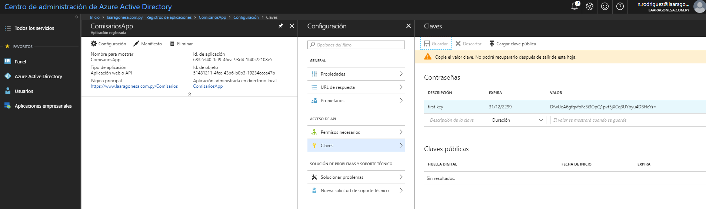

# Como agregar transform Web.Config 

[Pagina web donde encontre la forma](https://www.c-sharpcorner.com/article/transform-web-config-file-while-deploying-the-web-application-project/)

# Como generar el ClientSecret

[Pagina donde encontre](https://docs.microsoft.com/en-us/azure/azure-resource-manager/resource-group-create-service-principal-portal)

Aqui se muestra paso por paso para generar el client secret para asi loguear mediante azure mi aplicacion

En la imagen de abajo se copia la parte donde se genero el cliente secret
