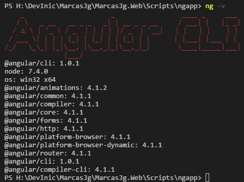
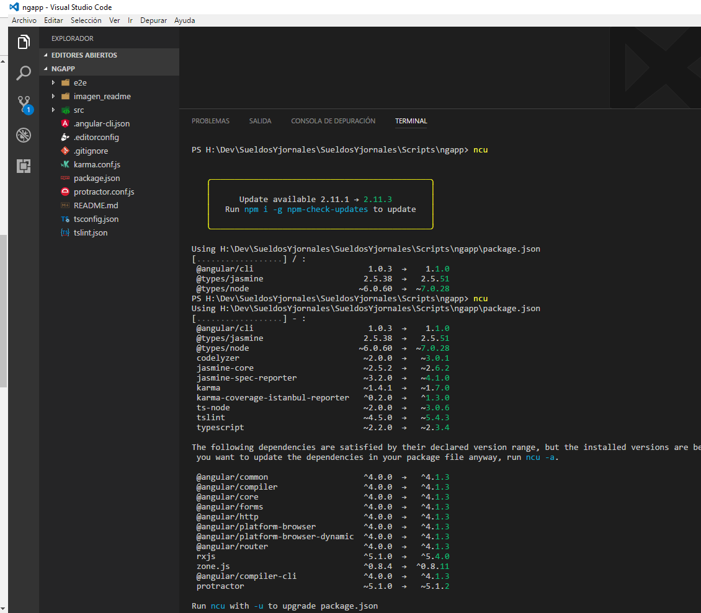
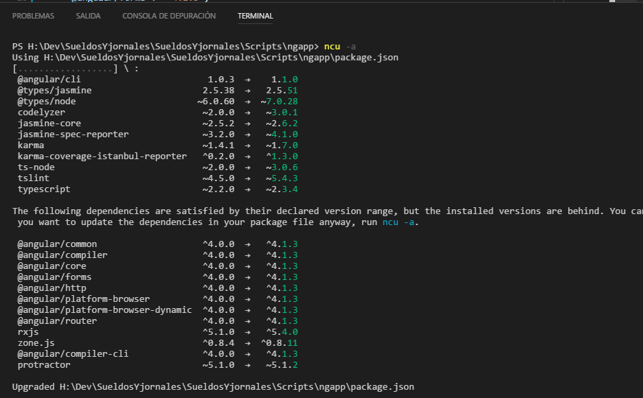

# ESTE PROYECTO FUE CREADO USANDO ANGULAR CLI
@angular/cli: 1.0.3



# INSTALAR BOOTSTRAP
Para instalar bootstrap con angular-cli segui los pasos vistos en
[stackoverflow](http://stackoverflow.com/questions/37649164/how-to-add-bootstrap-to-an-angular-cli-project). Tambien muestra como instalar ng2-bootstrap en la
misma respuesta.
```javascript
npm install bootstrap --save
```
# CHEQUEAR ACTUALIZACIONES DE ANGULAR

Se puede utilizar **npm-check-updates** o **npm outdated**
* referencias
    * [stackoverflow](http://stackoverflow.com/questions/36597780/how-do-i-correctly-upgrade-angular-2-npm-to-the-latest-version)

  

  
# USO DE LODASH
[Stackoverflow](https://stackoverflow.com/questions/41991178/correct-way-of-importing-and-using-lodash-in-angular)

```javascript
npm install lodash --save;
npm install @types/lodash --save-dev
```
```javascript
npm install lodash-es --save
npm install @types/lodash-es --save-dev
```


Al final use 
```javascript
import * as _ from "lodash";
```
porque la referencia que aconsejan en [Stackoverflow](https://stackoverflow.com/questions/41991178/correct-way-of-importing-and-using-lodash-in-angular) no funciona a saber:
```javascript
import debouce from 'lodash-es/debounce'
```

# USO DE [PRIMENG](https://www.primefaces.org/primeng/#/)
```javascript
npm install primeng --save
```

Para refrescar un DataGrib luego de modificar el array que utilizaba como fuente mediante lodash, utilice la sugerencia de [stackOverflow](https://stackoverflow.com/questions/40077150/how-to-programmaticaly-trigger-refresh-primeng-datatable-when-a-button-is-clicke)

# USO DE FONT-AWESOME

```javascript
npm install font-awesome --save
```

# ANGULAR/ANIMATIONS
```javascript
npm install @angular/animations --save
```

```javascript
npm install @angular/animations@latest --save //Ultima version estable
```
